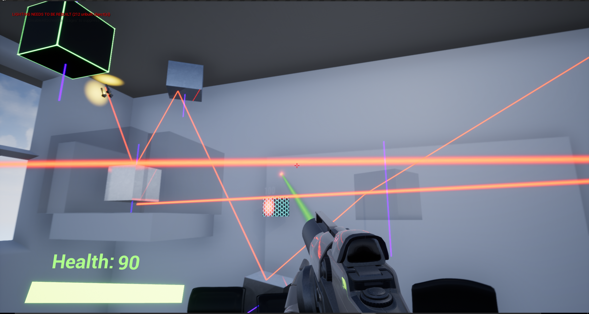
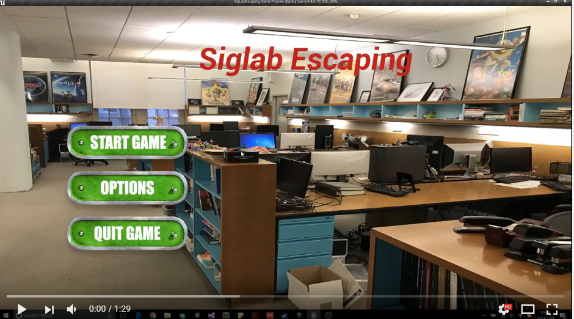

# Unreal-Game-Development-Siglab-Escaping-
Siglab Escaping is a puzzle-solving escaping game. 

The character is stuck in the Siglab, which is the labratory of CGGT and DMD student in Upenn.

Player can manipulate the orientation and materials of the special objects by shooting material bullets, the goal is to enable the laser to hit on the specific targets in the scene and open the door to escape.

# Description
`Unreal 4.15.1` `Blueprint` `FPS` `Puzzle` `Escaping`
# Screenshots

# Demos
* **Beta Version**

